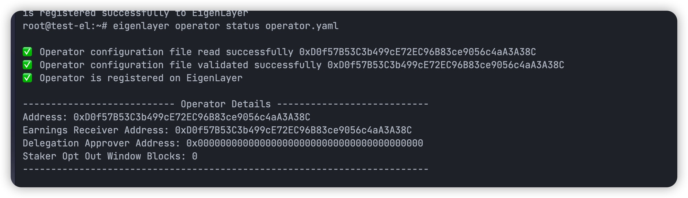

# EigenLayer Holesky Operator 搭建教程

## 一、简要流程图


## 二、详细部署文档

### 1. 环境准备

1. OS → ubuntu
2. go ≥ 1.21

    ```bash
    wget https://golang.org/dl/go1.22.1.linux-amd64.tar.gz
    sudo tar -C /usr/local -xzf go1.22.1.linux-amd64.tar.gz
    export PATH=$PATH:/usr/local/go/bin
    go version
    ```

3. Docker

    ```bash
    sudo apt update
    curl -fsSL https://download.docker.com/linux/ubuntu/gpg | sudo apt-key add -
    sudo add-apt-repository "deb [arch=amd64] https://download.docker.com/linux/ubuntu $(lsb_release -cs) stable"
    sudo apt update
    sudo apt install docker-ce
    sudo systemctl status docker
    sudo docker run hello-world
    docker images
    ```

4. docker compose

    ```bash
    sudo curl -L "https://github.com/docker/compose/releases/download/v2.2.3/docker-compose-$(uname -s)-$(uname -m)" -o /usr/local/bin/docker-compose
    sudo chmod +x /usr/local/bin/docker-compose
    docker-compose --version
    ```

5. RPC 准备

   https://chainlist.org/


### 2. eigenlayer-cli 安装

```bash
git clone https://github.com/Layr-Labs/eigenlayer-cli.git
cd eigenlayer-cli
mkdir -p build
go build -o build/eigenlayer cmd/eigenlayer/main.go
sudo cp ./build/eigenlayer /usr/local/bin/
eigenlayer
```

   

### 3. 注册成为 Operator 角色

1. 创建 operator keys

    ```bash
    # 初始化节点运行的 key
    eigenlayer operator keys create --key-type ecdsa yourNodeName
    
    # 初始化 BLS 的 key
    eigenlayer operator keys create --key-type bls yourNodeName
    ```

2. 查看 operator keys

    ```bash
    eigenlayer operator keys list
    ```

3. 创建 Github Public 仓库，并且设置规定参数

   生成 metadata.json 文件，内容如下

    ```bash
    {
        "name": "coinsummer",
        "website": "https://coinsummer.io/",
        "description": "Coinsummer operator",
        "logo": "https://raw.githubusercontent.com/CoinSummer/eigenlayer-operator/main/cs_logo.png",
        "twitter": "https://twitter.com/coin_summer"
    }
    ```

   最后 push 到 Github 上，获取 Github 的 Raw 链接（注意 logo 必须为 png 格式的）。

   [demo metadata](https://raw.githubusercontent.com/CoinSummer/eigenlayer-operator/main/holesky/metadata.json)

4. 生成 eigenlayer operator 的配置文件

    ```bash
    eigenlayer operator config create
    # 正常生成以后，会在当前目录下生成两个文件，metadata.json  operator.yaml
    ```

   必须设置以下参数，否则后面的流程会发生异常。

    1. operator address
    2. earnings address
    3. rpc URL
    4. ecdsa key path
    5. network 选择 holesky

    ---

   设置完成时，最后会生成两个文件，分别为 metadata.json，operator.yaml 的文件。

   只需要更新 operator.yaml 文件的 metadata_url 即可。

    ```yaml
    operator:
        address: 0x6c76a22052d5e8bbad9801bf1e413477843af698
        earnings_receiver_address: 0x6c76a22052d5e8bbad9801bf1e413477843af698
        delegation_approver_address: "0x0000000000000000000000000000000000000000"
        staker_opt_out_window_blocks: 0
        metadata_url: "your GitHub metadata raw link" # 修改这里，其他的不需要修改
    el_delegation_manager_address: 0xA44151489861Fe9e3055d95adC98FbD462B948e7
    eth_rpc_url: https://ethereum-holesky-rpc.publicnode.com
    private_key_store_path: /home/ubuntu/.eigenlayer/operator_keys/cs-eigenlayer-holesky.ecdsa.key.json
    signer_type: local_keystore
    chain_id: 17000
    
    ```

5. 注册成为 operator

   该步骤会发送交易上链，因此需要首先确保 operator address 有手续费。

    ```bash
    eigenlayer operator register operator.yaml
    ```

    

6. 查看 operator 的状态

    ```bash
    eigenlayer operator status operator.yaml
    ```
   
   

7. 更新 operator

   更新的本质是重新发送一笔上链的交易，更新 operator 的内容

    ```bash
    eigenlayer operator update operator.yaml
    ```

8. 质押 LST 资产并且委托给该 operator
    1. https://holesky.eigenlayer.xyz/
    2. [ETH 置换 LST 资产链接](https://docs.eigenlayer.xyz/eigenlayer/restaking-guides/restaking-user-guide/stage-2-testnet/obtaining-testnet-eth-and-liquid-staking-tokens-lsts)

   


### 4. [eigenda-operator-setup 设置](https://docs.eigenlayer.xyz/eigenda/operator-guides/eigenda-avs-installation-registration-and-upgrade/holesky)

1. 环境设置

    ```bash
    git clone https://github.com/Layr-Labs/eigenda-operator-setup.git
    cd eigenda-operator-setup/holesky/
    cp .env.example .env
    ```

   重点修改 .env 注释中标记的 TODO 内容

    ```bash
    ###############################################################################
    # TODO: IP of your node
    NODE_HOSTNAME=127.0.0.1 # 你的公网 IP
    
    # TODO: Node Nginx config
    NODE_NGINX_CONF_HOST=../resources/rate-limit-nginx.conf
    
    # TODO: Operators need to point this to a working chain rpc
    NODE_CHAIN_RPC=https://ethereum-holesky-rpc.publicnode.com
    NODE_CHAIN_ID=17000
    
    # TODO: Operators need to update this to their own paths
    USER_HOME=/home/ubuntu
    EIGENLAYER_HOME=${USER_HOME}/.eigenlayer
    EIGENDA_HOME=${EIGENLAYER_HOME}/eigenda/holesky
    
    NODE_LOG_PATH_HOST=${EIGENDA_HOME}/logs
    NODE_G1_PATH_HOST=${USER_HOME}/eigenda-operator-setup/resources/g1.point
    NODE_G2_PATH_HOST=${USER_HOME}/eigenda-operator-setup/resources/g2.point.powerOf2
    NODE_DB_PATH_HOST=${EIGENDA_HOME}/db
    NODE_CACHE_PATH_HOST=${USER_HOME}/eigenda-operator-setup/resources/cache
    
    # TODO: Operators need to update this to their own keys
    # 如果在使用 eigenlayer 创建 operator 时，自定义了 operator name，那么需要将下面的文件名更改成 operator 的内容
    NODE_ECDSA_KEY_FILE_HOST=${EIGENLAYER_HOME}/operator_keys/cs-eigenlayer-holesky.ecdsa.key.json
    NODE_BLS_KEY_FILE_HOST=${EIGENLAYER_HOME}/operator_keys/cs-eigenlayer-bls-holesky.bls.key.json
    
    # TODO: The ip provider service used to obtain a node's public IP [seeip (default), ipify)
    NODE_PUBLIC_IP_PROVIDER=seeip
    
    # TODO: Operators need to add password to decrypt the above keys
    # If you have some special characters in password, make sure to use single quotes
    NODE_ECDSA_KEY_PASSWORD='' # operator ecsda 的密码
    NODE_BLS_KEY_PASSWORD='' # operator bls 的密码
    ```

2. 注册 operator 到 AVS 中

    ```bash
    ./run.sh opt-in # 如果遇到 docker 权限问题，修改 run.sh 的内容，在 docker 前加 sudo
    ```

   

   正常运行后，会发送一笔交易注册该 operator 到 AVS 合约，交易成功后证明已经成功 opt-in

    ```bash
    # 使用 docker 管理
    docker compose up -d
    docker logs -f <container_id> 
    
    # 退出
    docker compose down
    ./run.sh opt-out
    ```

   [eigenda-operator-setup/holesky at master · Layr-Labs/eigenda-operator-setup](https://github.com/Layr-Labs/eigenda-operator-setup/tree/master/holesky)

3. 端口开放

   端口开放：32004, 32005

4. 日志观察

    ```prolog
    // 签署了 message 内容，并成功更新 DB 才算是正常
    
    time=2024-03-27T11:51:05.293Z level=DEBUG source=/app/node/node.go:330 msg="Validate batch took" duration:=698.52309ms
    time=2024-03-27T11:51:05.293Z level=DEBUG source=/app/node/node.go:340 msg="Store batch took" duration:=0s
    time=2024-03-27T11:51:05.293Z level=DEBUG source=/app/node/node.go:346 msg="Signed batch header hash" pubkey=0x25cb45c1340f12ba9e2cd7c8383c9e328f64b23bdab5e8db78a0e1151f0634fc0d1e61488df2e7c613eab37293b4abea8a53192236d75b5eb3323e072513b41a2b31f1211c50cd32725d8fce51645716b36e45fe1a96f54982274963b9333e1309563c1ef5c7ac1f10336ba1e89774ffb856b013374aa7752aea3262642e58ff
    time=2024-03-27T11:51:05.293Z level=DEBUG source=/app/node/node.go:349 msg="Sign batch took" duration=554.091µs
    time=2024-03-27T11:51:05.293Z level=INFO source=/app/node/node.go:351 msg="StoreChunks succeeded"
    time=2024-03-27T11:51:05.293Z level=DEBUG source=/app/node/node.go:353 msg="Exiting process batch" duration=699.593191ms
    Batch verify 51 frames of 1 symbols out of 51 blobs
    time=2024-03-27T11:51:54.488Z level=DEBUG source=/app/node/node.go:330 msg="Validate batch took" duration:=305.901818ms
    time=2024-03-27T11:51:54.488Z level=DEBUG source=/app/node/node.go:340 msg="Store batch took" duration:=1ms
    time=2024-03-27T11:51:54.489Z level=DEBUG source=/app/node/node.go:346 msg="Signed batch header hash" pubkey=0x25cb45c1340f12ba9e2cd7c8383c9e328f64b23bdab5e8db78a0e1151f0634fc0d1e61488df2e7c613eab37293b4abea8a53192236d75b5eb3323e072513b41a2b31f1211c50cd32725d8fce51645716b36e45fe1a96f54982274963b9333e1309563c1ef5c7ac1f10336ba1e89774ffb856b013374aa7752aea3262642e58ff
    time=2024-03-27T11:51:54.489Z level=DEBUG source=/app/node/node.go:349 msg="Sign batch took" duration=432.455µs
    time=2024-03-27T11:51:54.489Z level=INFO source=/app/node/node.go:351 msg="StoreChunks succeeded"
    time=2024-03-27T11:51:54.489Z level=DEBUG source=/app/node/node.go:353 msg="Exiting process batch" duration=306.529131ms
    ```

    ```prolog
    // 大面积出现，说明异常，需要检查配置，检查网络设置。偶尔出现没有问题，因为异步任务执行
    // 真的可能没有任何需要更新的内容
    
    msg="Complete an expiration cycle to remove expired batches" "num expired batches found and removed"=
    msg="Complete an expiration cycle to remove expired batches" "num expired batches found and removed"=
    msg="Complete an expiration cycle to remove expired batches" "num expired batches found and removed"=
    msg="Complete an expiration cycle to remove expired batches" "num expired batches found and removed"=
    msg="Complete an expiration cycle to remove expired batches" "num expired batches found and removed"=
    msg="Complete an expiration cycle to remove expired batches" "num expired batches found and removed"=
    msg="Complete an expiration cycle to remove expired batches" "num expired batches found and removed"=
    msg="Complete an expiration cycle to remove expired batches" "num expired batches found and removed"=
    ```

   

   


### 5. EigenDA 监控设置

[eigenda-operator-setup/monitoring at master · Layr-Labs/eigenda-operator-setup](https://github.com/Layr-Labs/eigenda-operator-setup/tree/master/monitoring)

```prolog
cd eigenda-operator-setup/monitoring/
cp .env.example .env

# 修改 .env 下的 prometheus.yml 的路径，没有的话，$HOME/.eigenlayer/config
	下创建 prometheus.yml
```

prometheus.yml 的文件内容，不需要改动。

```yaml
global:
  scrape_interval: 15s # By default, scrape targets every 15 seconds.

  # Attach these labels to any time series or alerts when communicating with
  # external systems (federation, remote storage, Alertmanager).
  external_labels:
    monitor: "codelab-monitor"

# A scrape configuration containing exactly one endpoint to scrape:
# Here it's Prometheus itself.
scrape_configs:
  # The job name is added as a label `job=<job_name>` to any timeseries scraped from this config.
  - job_name: "prometheus"

    # Override the global default and scrape targets from this job every 5 seconds.
    scrape_interval: 5s

    static_configs:
      # Point to the same endpoint that EigenDA is publishing on
      - targets: ["localhost:<NODE_METRICS_PORT>"]
```

docker 管理 monitor

```bash
docker compose up -d
docker network connect eigenda-network prometheus
```

更多细节看 Github 文档。

浏览器打开 http://127.0.0.1:3000/

浏览器打开 http://127.0.0.1:3000/

```bash
账号：admin
密码：admin
```
   
